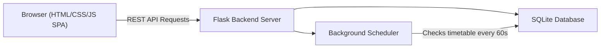

# Smart Classroom Availability System

The **Smart Classroom Availability System** is a real-time web application designed to track and display the availability of classrooms, labs, and seminar halls in educational institutions. This system helps students and faculty find vacant rooms instantly, reducing time wastage and improving campus resource utilization.

Built as part of the **Business Communications And Value Sciences (BCVS)** Course Based Project at VNR VJIET.

## 🚀 Features

- **📊 Real-time Dashboard:** View live status of all rooms (Vacant, Occupied, Maintenance) with color-coded pulsing indicators.
- **📅 Timetable Scheduling:** View class schedules by day and room.
- **🔄 Auto-Updates:** The backend automatically updates room statuses based on the day's timetable schedule.
- **📝 Crowdsourced Reports:** Users can manually report a room's current status (vacant/occupied).
- **⚙️ Admin Panel:** Easily toggle room status with a single click, add new schedule entries, and delete existing schedules.
- **📈 Analytics & Statistics:** Interactive charts showing utilization rates, room distribution by building, floor, and room type.

## 🏗️ Architecture

The system uses a modern, lightweight full-stack architecture:



## 🛠️ Technology Stack

- **Frontend:** HTML5, CSS3 (Custom Glassmorphism Design System), Vanilla JavaScript
- **Backend:** Python, Flask, Flask-CORS
- **Database:** SQLite with SQLAlchemy ORM

## 📂 Folder Structure

```text
project/
├── backend/
│   ├── app.py              # Flask API server & background scheduler
│   ├── models.py           # SQLAlchemy database models
│   ├── requirements.txt    # Python dependencies
│   ├── seed_data.py        # Script to pre-populate DB with sample rooms/schedules
│   └── smart_classroom.db  # SQLite database
├── frontend/
│   ├── index.html          # Main Single Page Application shell
│   ├── css/
│   │   └── style.css       # Design system and styling
│   └── js/
│       └── app.js          # Client-side routing, API fetching, UI rendering
├── .gitignore
└── README.md
```

## 💻 Setup & Installation

Follow these instructions to run the project locally.

### Prerequisites
- Python 3.8+ installed on your machine.

### Installation Steps

1. **Clone the repository:**
   ```bash
   git clone https://github.com/purumishra10/smart-classroom-availability-system.git
   cd smart-classroom-availability-system
   ```

2. **Navigate to the backend directory:**
   ```bash
   cd backend
   ```

3. **Install the required dependencies:**
   ```bash
   pip install -r requirements.txt
   ```

4. **Seed the database (Run this once):**
   This will create `smart_classroom.db` and populate it with sample rooms and timetables.
   ```bash
   python seed_data.py
   ```

5. **Start the Flask Server:**
   ```bash
   python app.py
   ```

6. **View the Application:**
   Open your browser and navigate to `http://localhost:5000` to interact with the application.

## 🔗 API Endpoints

- `GET /api/rooms` - List all rooms and their current statuses
- `GET /api/rooms/<id>` - Get specific room details, today's schedule, and recent history
- `PUT /api/rooms/<id>/status` - Admin endpoint to update a room's status manually
- `GET /api/schedule` - Fetch timetable records (supports `?day=` and `?room_id=` queries)
- `POST /api/schedule` - Add a new timetable entry
- `DELETE /api/schedule/<id>` - Remove a timetable entry
- `POST /api/report` - Submit a crowdsourced room availability report
- `GET /api/reports` - Fetch recent user reports
- `GET /api/stats` - Fetch overall utilization statistics and metrics

## 👥 Team Members

This project was developed by:
- Sreeja (24071A3237)
- Purusharth Mishra (24071A3251)
- Hasmitha Reddy (24071A3258)
- Vitika Prajapati (24071A3263)

*Under the guidance of Dr. Kanchana Sundaram, VNR VJIET.*
